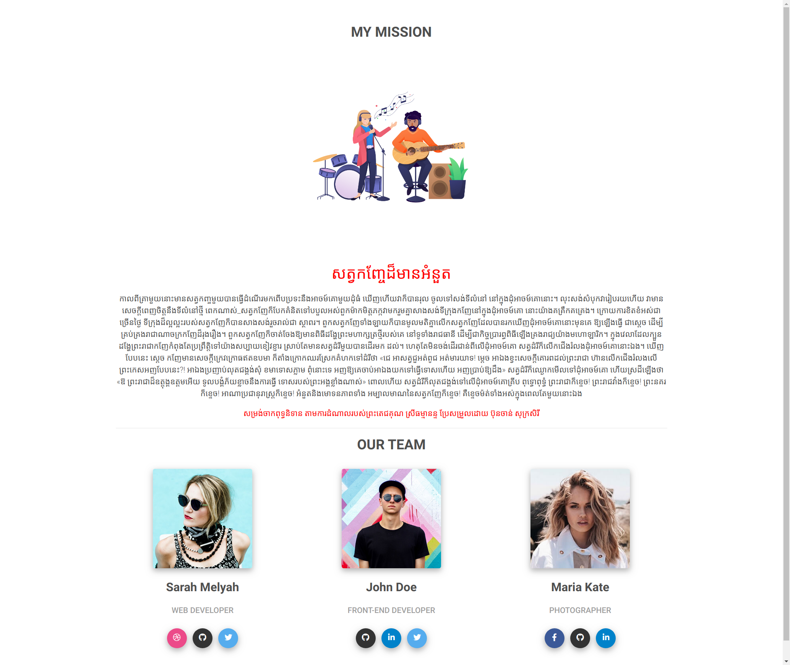
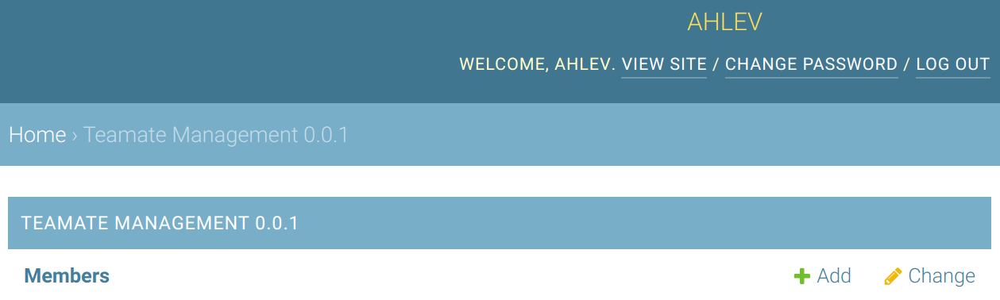
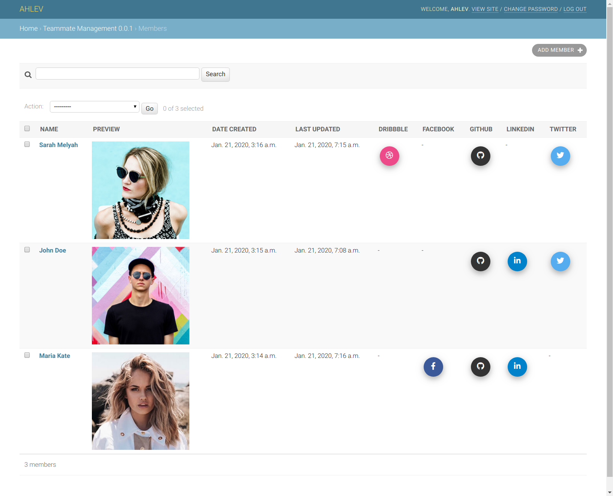
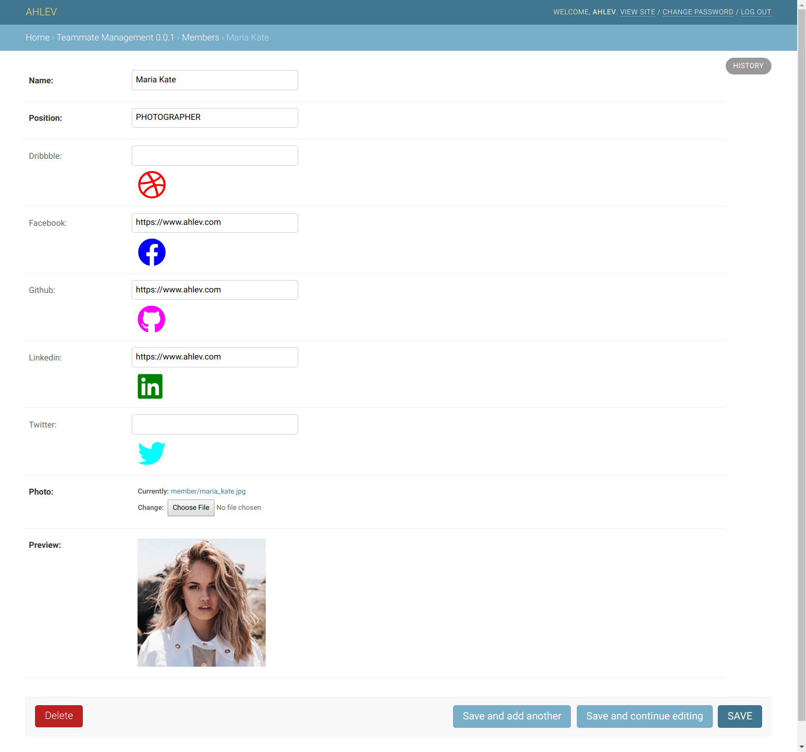

# DJANGO TEAM APPLICATION
 

This django application is used to show team members in about us page.

## prerequisites
The instructions below assume that you have a django project already set up; and a python virtual environment already installed and activated. 

## styles
All ahlev-django applications are using styles from [mdbootstrap.com](https://mdbootstrap.com), so please make sure you install [ahlev-django-css-js](https://github.com/ohahlev/ahlev-django-css-js.git) first.

## install from this repository
### clone
```
git clone https://github.com/ohahlev/ahlev-django-team.git
```

### go to directory ahlev-django-team
```
cd ahlev-django-team
```

### create installer package
```
make package
```

### install package
Let's say ahlev-django-team directory is in the same level as the project directory.

cd into project directory
```
cd ../my_project_dir
```
install ahlev-django-team from the project directory
```
pip install ../ahlev-django-team/dist/ahlev-django-team-0.0.1.tar.gz
```

## install from pypi
[ahlev-django-team](https://pypi.org/project/ahlev-django-team/)

## project configuration
### update settings.py as the following
```
INSTALLED_APPS = [
    'about_us'
    'team', # add this line, make sure it stays under about_us
    ...
]
```

### add these lines to the end of settings.py
```
STATICFILES_DIRS = [
    os.path.join(BASE_DIR, "static")
]
STATIC_URL = '/static/'
MEDIA_ROOT = os.path.join(BASE_DIR, 'uploads')
MEDIA_URL = '/medias/'
```

## screenshots
### frontend: about us page with team member info


### backend: teammate management


### backend: list all members in team


### backend: edit a member in team

